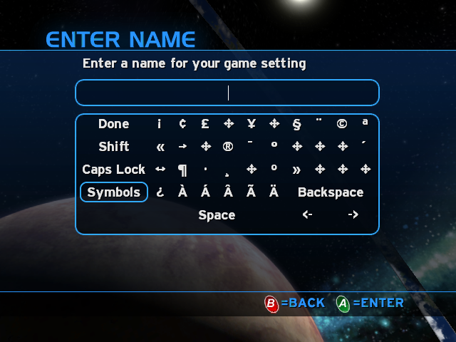
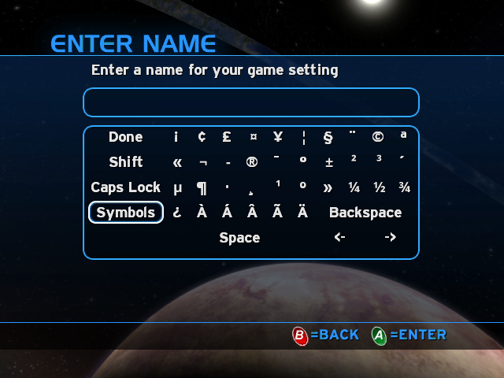
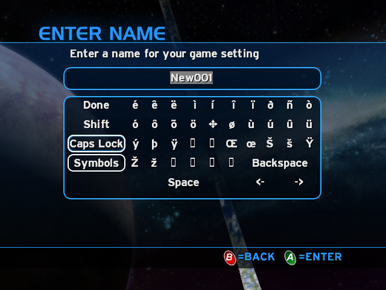
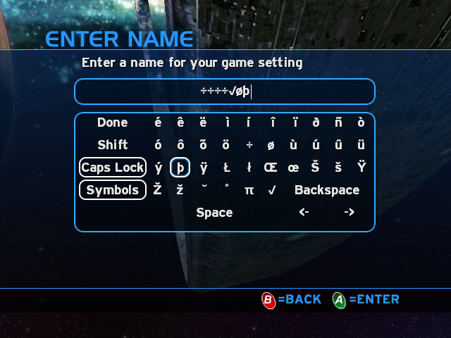

# Font Slicer

This is a tool that splits Halo CE font tags into individual files that represent each character.
This way characters can be replaced and/or added, and then recombined to make a new font tag.

## Why?

To allow adding extra characters to a Halo font.
Font rendering is never consistent. Even if you find a TTF of the font you want to modify, and use the original tools, it still might not render the same.
So if you want to add to an existing font without changing the base character set, you have to do it at this level.

## Usage

`font-slicer split <full path to font tag> <directory to place characters>`
This will split a font tag into font characters named xx.bin, where xx is the unicode character in decimal. So `A` will be `65.bin` and so on.

`font-slicer join <directory of characters> <full path where new font tag will be made>`
This will make a new font tag from a directory of character files.
The idea is that you would make a donor font the same size as the font you want to modify, split it and then merge the desired character files into one directory.
I recommend using `invader-font` as `tool.exe` (any version) font rendering seems to be broken, as it can not make any font to the same quality of the ones that come with the game.

Don't forget to check the ascending and descending height values. the new tag will have generated values and these might not match custom values used in the original tag. This is the case for small_ui and large_ui.

## Example

Here are screenshots of this tool being used to fix the symbols table on the Xbox version.

 
 
